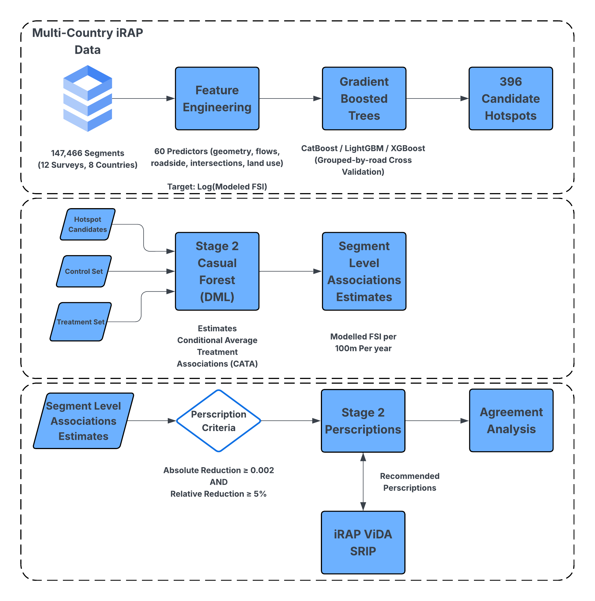

# A Two-Stage Machine Learning and Causal Forest Framework for Modelled Road Safety



This repository contains the core code for a two‑stage pipeline:

- **Stage 1**: predictive modeling and risk estimation
- **Stage 2**: causal analysis and treatment effect estimation

## Repository Structure

```
stage1/
  ...
stage2/
  ...
```

## Requirements

Two Python environments are used:

- **Stage 1**: Dependencies listed in `requirements-stage1.txt`
- **Stage 2**: Dependencies listed in `requirements-stage2.txt`

Install dependencies with:

- Stage 1: `pip install -r requirements-stage1.txt`
- Stage 2: `pip install -r requirements-stage2.txt`

## Usage

### Stage 1

Run the Stage 1 entry point (see `stage1/stage1_main.py`) after configuring inputs in `stage1/stage1_config.py`.

### Stage 2

Run the Stage 2 entry point (see `stage2/stage2_cf_prescription_generation.py` or other scripts) after setting parameters in `stage2/stage2_config.py`.

## Citation

If this repo helped you, please cite the associated paper or report. Thank You
